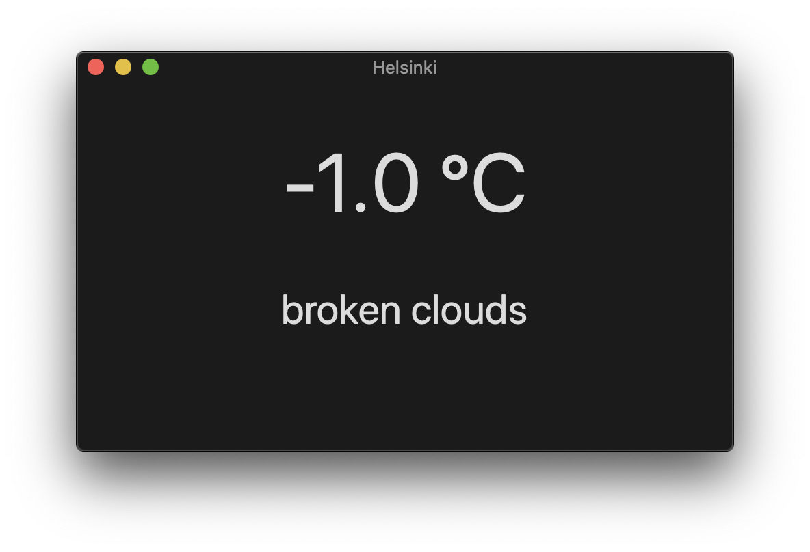

# OpenWeatherMap API Demo

Example of how to make HTTP GET request using Swift in macOS app.

## Setup

- Register to https://openweathermap.org
- Generate a new API key
- Add API key to `Globals.swift` file
- Edit location and measurement system in `Globals.swift`

## App window

## Additional information

- App Transport Security Settings > Allow Arbitrary Loads is set to `YES` because the endpoint uses http
- You might see "Unable to load Info.plist exceptions (eGPUOverrides)" error message in log output. Mojave bug?